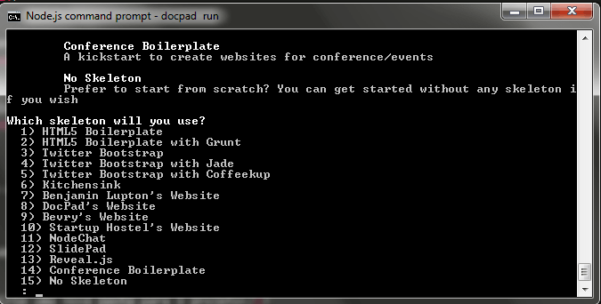

## NodeJS e o NPM

O primeiro passo, como havia falado, é entender o mínimo do funcionamento do [NodeJS](http://nodejs.org) e seu gerenciador de pacotes, o [NPM](https://npmjs.org).

Se você usa Windows, basta baixar a [última versão](http://nodejs.org/#download) e instalar.

Nesse momento não é necessária nenhuma configuração especial, apenas deixe todas as opções ativadas e será instalado o NodeJS, alguns módulos nativos e o NPM.

Para instalar em outros sistemas operacionais, pode ler esse [passo a passo](http://bevry.me/learn/node-install).

## Instalando o Docpad

1. Abra seu terminal

2. Procure atualizações no NPM com o comando

    ````bash
    npm install -g npm
    ````

3. Instale o Docpad

    ````bash
    npm install -g docpad
    ````

## Criando um projeto

1. No terminal vá até a pasta que deseja criar o projeto.

2. Crie uma nova pasta para o projeto

````bash
mkdir NOME-DO-PROJETO
````

3. Entre na pasta

````bash
cd NOME-DO-PROJETO
````

4. Inicie o projeto

````bash
docpad run
````

5. Escolha o esqueleto que deseja usar



## Comece a brincar!

Após escolher um esqueleto (menos quando escolher a opção 15), já terá uma base para começar a brincar e entender o como funciona o desenvolvimento.

Para criar esse site, usei o esqueleto 1 - HTML5 Boilerplate.

1. Aperte "CRTL + C" e saia da aplicação.

2. Agora considerando que você TENHA escolhido um esqueleto, na pasta do projeto digite

    ````bash
    npm install
    ````

    Isso vai instalar as dependências do projeto.

3. Rode novamente

    ````bash
    docpad run
    ````

Você deve alterar os arquivos da pasta **src/**, o Docpad automaticamente vai gerar uma pasta **out/** com os HTMLs gerados, essa pasta você não deve alterar.

## Mais informações

Nesse post, mostrei apenas os primeiros passos.

Para continuar o desenvolvimento, o [site do Docpad](http://docpad.org) tem um guia bem bacana de uso.

Não se assuste se achar difícil no começo, garanto que é questão de tempo até que esteja fazendo coisas bem legais com essa ferramenta.

É isso amigos, espero que contribua de alguma forma. Não sou mestre no Docpad, alias domino bem pouco e faço apenas coisas mais básicas. Mas caso tenha dúvidas, pergunte e tento ajudar no que conseguir.
