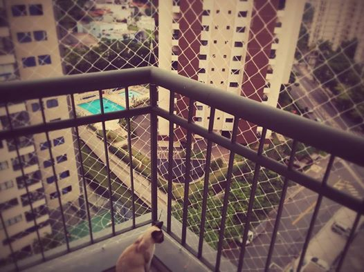
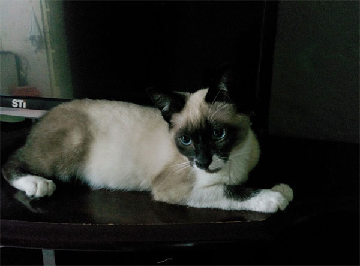

## Mas antes...

Muitos já devem ter visto, mas [criei um repositório](https://github.com/felipefialho/1-post-por-dia) para resolver um dos maiores problemas na hora de escrever um novo artigo: escolher um assunto/tema.

Esse post foi feito em cima de [um pedido](https://github.com/felipefialho/1-post-por-dia/issues/12) do [Matheus Moraes](https://github.com/matheusmmo), e o assunto já teve postagens do [Willian Justen](http://willianjusten.com.br/meu-dia-a-dia-como-dev-frontend) e do [Fernando Daciuk](http://blog.da2k.com.br/2015/01/15/como-ser-um-dev-frontend-usando-linux).

## Local de trabalho

Esse ano comecei a trabalhar remoto. Portanto minha casa também virou meu local de trabalho, e esse é um ponto importante. É interessante ter um ambiente legal e confortável, e de preferência com lazer próximo para poder se distrair quando necessário.

Considero apartamentos uma boa alternativa, já que normalmente oferecem coisas como piscina e academia. Além de ter uma coisa fundamental para relaxar a mente quando necessário: Uma sacada.

## Equipamentos

Uma bancada para os seus equipamentos é uma solução barata e que funciona muito bem. Também é legal manter por perto um caderninho para anotações rápidas.

Um sistema operacional robusto e confiável é muito importante. Por isso eu uso Windows :). Tirando a parte do "robusto e confiável" eu realmente uso Windows, como podem confirmar na foto acima. Sendo mais preciso <strike>Windows 8.1</strike> **Windows 10**.

Meu notebook é um **DELL** com a seguinte configuração:

- Monitor 15,6' com Touch Display, IPS
- Resolução Full HD (1920 x 1080)
- Processador Intel Core i7
- 16GB de memória
- Placa de vídeo AMD Radeon M265 2GB DDR3
- 1 TB de HD + 8GB SSD

É uma configuração robusta que tem me atendido muito bem.

Além disso, tenho um monitor de 23' IPS da LG como tela secundária. Nada como deixar o **Sublime** na tela principal, e o projeto atualizando na tela secundária em tempo real através do **Browser Sync**.

E claro... tenho um gato, eles são fontes inesgotáveis de entretenimento e diversão.

## Aplicativos

Basicamente os aplicativos que utilizo para trabalhar são:

- [Sublime Text 2](http://www.sublimetext.com/2), como editor
- [Google Chrome](http://www.google.com.br/chrome), como browser principal
- [Dev Tools](https://developer.chrome.com/devtools), para debug
- [Cmder](http://cmder.net), para o terminal
- **Photoshop**, como editor de imagens/layout

Como aplicativos de suporte:

- [Dropbox](https://www.dropbox.com), para troca de arquivos
- [Evernote](https://evernote.com/intl/pt-br), para organização pessoal
- [Jira](https://www.atlassian.com/software/jira), como _issue tracking_ e marcação de tempo
- [Tomato Timer](http://tomato-timer.com/#) ,para calculo de Pomodoros
- [Spotify](https://www.spotify.com/br), como player de música

## Workflow

Podem ter uma noção melhor do meu workflow técnico (de 2014, desatualizado) lendo os posts abaixo:

- [Falando em organização - Parte I](/blog/2014/falando-em-organizacao-parte-1)
- [Falando em organização CSS](/blog/2014/falando-em-organizacao-css)

E pode ver meu estilo de código e boilerplate aqui:

- [My Coding Style](https://github.com/felipefialho/coding-style)
- [Kratos Boilerplate](https://github.com/felipefialho/kratos-boilerplate)

Atualmente utilizo no meu workflow:

- [Stylus](http://learnboost.github.io/stylus) e [PostCSS](https://github.com/postcss), como pré-processador CSS
- [Lost](https://github.com/peterramsing/lost), para criação de grids
- [Rupture](https://jenius.github.io/rupture), para fornecer media queries
- [Rucksack](http://simplaio.github.io/rucksack), para incrementar o CSS
- [Jade](http://jade-lang.com), como template engine
- [Zepto.js](http://zeptojs.com), como framework JavaScript
- [Git](http://git-scm.com), para versiomento
- [Gulp](http://gulpjs.com), como _task-builder_
- [NPM](https://www.npmjs.com), como gerenciador de dependências

Importante lembrar que ferramentas, aplicativos e todas essas maravilhas modernas, são apenas facilitadores para que possamos entregar o melhor trabalho possível. Se apegue mais ao conceito, e menos nas ferramentas, porque normalmente, elas são passageiras.

E é isso! :D

Status API Training Shop Blog About © 2016 GitHub, Inc. Terms Privacy Security Contact Help
